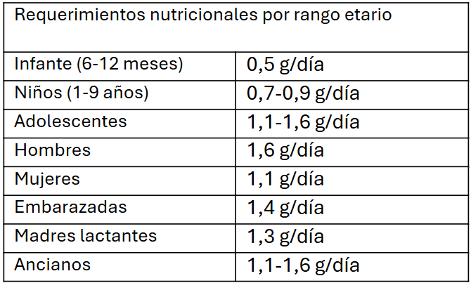

[^50]

[^50]: Office of Dietary Supplements - Omega-3 fatty acids. (n.d.). https://ods.od.nih.gov/factsheets/Omega3FattyAcids-HealthProfessional/#h2

El omega 3 son un grupo heterogéneo de ácidos grasos con doble cadena en el carbono ω−3, los más relevantes en la nutrición humana son acido eicosapentaenoico/EPA (cadena 20:5-3), acido eicosapentaenoico/DHA (22:6n-3), acido alfa-linoleico/ALA (18:3n-3)[^1][^3].  EPA y DHA son encontrados principalmente en carnes de pescado de aguas frías, ya que en su ambiente natural requieren de mayor contenido lipídico para adaptarse a las temperaturas. Pescados como atun, salmón y sardinas son buenas fuentes de omega 3[^2]. 

[^1]: Saini, R. K., & Keum, Y. S. (2018). Omega-3 and omega-6 polyunsaturated fatty acids: Dietary sources, metabolism, and significance—A review. Life sciences, 203, 255-267.
[^2]: National Institutes of Health. (2020). Office of Dietary Supplements. Omega-3 fatty acids.
[^3]: Cholewski M., Tomczykowa M., Tomczyk M. A comprehensive review of chemistry, sources and bioavailability of omega-3 fatty acids. Nutrients. 2018;10(11):1662. doi: 10.3390/nu10111662. 

Para una persona normal sin comorbilidades se recomienda un consumo diario de 250 mg de EPA y 500 mg de DHA[^4], las necesidades pueden variar según las necesidades del individuo, por ejemplo, aquellas personas en tratamiento con estatinas que quieran bajar sus niveles de colesterol LDL deben consumir una concentración mayor dada por el médico tratante.  

Se considera que un mayor consumo de pescados se relaciona con un menor riesgo de accidentes cardiovasculares[^4]. Se ha observado que, en países con una dieta con mayor consumo diario de pescado como países mediterráneos, la incidencia de mortalidad asociada a accidentes cardiovasculares es considerablemente menor al resto del mundo, así mismo, se ha relacionado con una mejor calidad de vida y conservación de la salud en la población adulto mayor. Estas observaciones han sido el punto de partida para las recomendaciones en el resto del mundo, sin embargo, también hay que considerar que la población del mediterráneo conserva un estilo de vida distinto a lo que se podría ver en el resto del mundo más allá de su dieta, en particular si se compara con países de tercer mundo.  

[^4]: Weinberg, R. L., Brook, R. D., Rubenfire, M., & Eagle, K. A. (2021). Cardiovascular impact of nutritional supplementation with omega-3 fatty acids. Journal of the American College of Cardiology, 77(5), 593–608. https://doi.org/10.1016/j.jacc.2020.11.060 

En los últimos años ha nacido el interés por descubrir porque los beneficios de la omega 3 sobre la salud pueden llegar a ser tan marcados entre persona y persona. Existen dos razones que se teorizan, en primer lugar, existe el estado de base del paciente, y es que cuando se compara el efecto sobre un paciente sano en comparación con un paciente con mayor necesidad basal la diferencia de mejoría se verá mucho más marcada en el último, existe un perfil de paciente que se verá mucho más beneficiado por su consumo. En segundo lugar, existe un componente genético que se debe considerar que afecta la efectividad general del consumo de omega 3 por lo que las necesidades pueden llegar a ser mayores, pero esto es una revisión personal difícil de dilucidar en la práctica. 

 

## Advertencias 

El omega 3 es un suplemento con un buen perfil de seguridad para la población general[^6]. Estudios de seguridad indicaron que la mayoría de los efectos adversos reportados se relacionaban con el consumo de tratamientos farmacológicos base del paciente afectado.  

[^6]: Chang, J. P., Tseng, P., Zeng, B., Chang, C., Su, H., Chou, P., & Su, K. (2023). Safety of Supplementation of Omega-3 Polyunsaturated Fatty Acids: A Systematic Review and Meta-Analysis of Randomized Controlled Trials. Advances in Nutrition, 14(6), 1326–1336. https://doi.org/10.1016/j.advnut.2023.08.003
[^5]: Lovaza (omega 3 fatty acids) dosing, indications, interactions, adverse effects, and more. (n.d.). https://reference.medscape.com/drug/lovaza-omega-3-fatty-acids-342455#5

Una de las interacciones con fármaco más notorias es con el uso de anticoagulantes como aspirina[^5]. Se reporto un aumento menor en el riesgo de sangrado en pacientes en tratamiento con anticoagulantes, se recomienda que se monitoreen los parámetros de coagulación. 

Se ha reportado que la molestia más común entre los consumidores es el fuerte aroma a aceite pescado que caracteriza las capsulas[^4], esto puede llegar a dificultar su consumo y dependiendo de la sensibilidad de la persona, podría suspenderse el tratamiento.  

Por la composición lipídica del suplemento se puede dar una alteración inesperada en la composición y frecuencia de las deposiciones, pero difícilmente conduciría a una diarrea[^5][^6]. 

Ya que las capsulas de omega 3 contienen aceite altamente purificado difícilmente se podría esperar una reacción alérgica[^4], sin embargo, se recomienda que personas que presenten alergia a productos marinos eviten el consumo de este suplemento. 

 

## Accion del omega 3 sobre el perfil lipídico 

El efecto del omega 3 reduciendo la concentración de colesterol LDL, VLDL, colesterol total y triglicéridos ha sido bien estudiado y reconocido por la comunidad científica. En la actualidad se utiliza mucho como tratamiento coadyuvante en pacientes con hipertrigliceridemia, proporcionando mejorías leves pero significativas en el perfil lipídico de los pacientes[^4]. 

Se considera que el consumo de omega 3 en dosis altas de 2-4 mg/día puede reducir la concentración de triglicéridos en sangre en un 25% hasta un 40% dependiendo del paciente[^4]. Por esta particularidad, suele utilizarse para tratar en pacientes con hipertrigliceridemia (>200 mg/dl) e hipertrigliceridemia severa (>500 mg/dl), sin embargo, no se ha comprobado que el consumo de omega 3 pueda prevenir las consecuencias de la hipertrigliceridemia severa[^4]. 

Los mecanismos de accion asociados a esta función contemplan en primer lugar el efecto sobre el transporte inverso de colesterol. El trasporte inverso del colesterol es el proceso donde el colesterol periférico es transportado al hígado por medio de la excreción hepatobiliar, con esto se reduce el colesterol en plasma y previenen la formación de la capa ateromatosa en las arterias[^7]. EPA y DHA promueven el catabolismo de apolipoproteínas trasportadoras de colesterol, esto resulta en un aumento del clerance de triglicéridos en sangre, mayor conversión de colesterol-VLDL a LDL contenido en el tejido adiposo permitiendo su retorno al hígado y promueve la reducción de síntesis de colesterol-LDL[^8][^9]. Otro mecanismo adicional que se sugiere es un aumento en la conversión del contenido lipídico a fosfolípidos en vez de triglicéridos gracias a la inhibición de la enzima PAP.

[^7]: Pizzini A., Lunger L., Demetz E., Hilbe R., Weiss G., Ebenbichler C., et al. The role of omega-3 fatty acids in reverse cholesterol transport: a review. Nutrients. 2017;9(10):1099. doi: 10.3390/nu9101099.
[^8]: Chan D.C., Watts G.F., Mori T.A., Barrett P.H., Redgrave T.G., Beilin L.J. Randomized controlled trial of the effect of n-3 fatty acid supplementation on the metabolism of apolipoprotein B-100 and chylomicron remnants in men with visceral obesity. Am. J. Clin. Nutr. 2003;77(2):300–307. doi: 10.1093/ajcn/77.2.300.
[^9]: Robinson J.G., Stone N.J. Antiatherosclerotic and antithrombotic effects of omega-3 fatty acids. Am. J. Cardiol. 2006;98(4A):39i–49i. doi: 10.1016/j.amjcard.2005.12.026.

Nuevos estudios han ahondado en la actividad de omega 3 en el perfil lipídico han observado una diferencia entre la accion de EPA y DHA. Experimentos in vitro han observado que la disminución de col-LDL se da con el consumo de EPA, pero no con DHA[^10][^11][^12].  

[^10]: Bays H.E., Ballantyne C.M., Kastelein J.J., Isaacsohn J.L., Braeckman R.A., Soni P.N. Eicosapentaenoic acid ethyl ester (AMR101) therapy in patients with very high triglyceride concentrations (from the Multi-center, plAcebo-controlled, Randomized, double-blINd, 12-week study with an open-label Extension [MARINE] trial) Am. J. Cardiol. 2011;108(5):682–690. doi: 10.1016/j.amjcard.2011.04.015.
[^11]: Ballantyne C.M., Bays H.E., Kastelein J.J., Stein E., Isaacsohn J.L., Braeckman R.A., Soni P.N. Efficacy and safety of eicosapentaenoic acid ethyl ester (AMR101) therapy in statin-treated patients with persistent high triglycerides (from the ANCHOR study) Am. J. Cardiol. 2012;110(7):984–992. doi: 10.1016/j.amjcard.2012.05.031.
[^12]: Bhatt, D. L., Steg, P. G., Miller, M., Brinton, E. A., Jacobson, T. A., Ketchum, S. B., ... & Ballantyne, C. M. (2019). Cardiovascular risk reduction with icosapent ethyl for hypertriglyceridemia. New England Journal of Medicine, 380(1), 11-22.

El bajo consumo de omega 3 en la dieta se ha asociado con una mayor resistencia a la insulina y sobrepeso[^13]. Se ha teorizado que el consumo de omega 3 podría facilitar la pérdida de peso, pero no se ha podido comprobar científicamente, pero si se ha observado una disminución del apetito y prevención de efecto revote en pacientes que ya perdieron peso[^14]. Un estudio clinico en humanos bajo un tratamiento con omega 3 y ejercicios demostró que, si bien la disminución de peso general en ambos grupos fue la misma, en el grupo suplementado se dio una mayor disminución de la grasa abdominal[^15].  

[^13]: Simopoulos AP. An Increase in the Omega-6/Omega-3 Fatty Acid Ratio
Increases the Risk for Obesity. Nutrients 2016;8(3):128. DOI: 10.3390/
nu8030128
[^14]: Albracht-Schulte , alupahana NS, Ramalingam L, Wang S, Rahman SM,
Robert-McComb J, et al. Omega-3 fatty acids in obesity and metabolic syndrome: a mechanistic update. J Nutr Biochem 2018;58:1-16. DOI: 10.1016/j.
jnutbio.2018.02.012
[^15]: Nutrición Hospitalaria - Arán Ediciones, S.L. (n.d.). https://www.nutricionhospitalaria.org/articles/03992/show#!

Para obtener resultados significativos sobre el perfil lipídico el consumo de omega 3 debe continuarse por un mínimo de 3 meses.  

 

## Accion sobre la protección cardiovascular 

La enfermedad cardiovascular refiere a un conjunto de enfermedades asociadas al mal funcionamiento del corazón y vasos sanguíneos. Entre estas encontramos enfermedades cerebrovasculares, enfermedades coronarias, enfermedades de las arterias periféricas, trombosis de las venas profundas, embolismo pulmonar, enfermedad reumática y enfermedad congénita del corazón[^17]. La enfermedad cardiovascular es la principal causa de muerte en el mundo, es una enfermedad compleja y multifactorial caracterizada por dislipidemia, estrés oxidativo e inflamación que afectan las arterias y forman la capa ateromatosa[^16]. 

[^16]: Steven S., Frenis K., Oelze M., Kalinovic S., Kuntic M., Bayo Jimenez M.T., Vujacic-Mirski K., Helmstädter J., Kröller-Schön S., Münzel T., et al. Vascular Inflammation and Oxidative Stress: Major Triggers for Cardiovascular Disease. J. Am. Heart Assoc. 2018;7:e007809. doi: 10.1155/2019/7092151.
[^17]: World Health Organization. Cardiovascular Diseases (CVDs).. Fact sheets; May 2017. www.who.int/mediacentre/factsheets/fs317/en (accessed 24 November 2017).

A día de hoy, dos de los estudios más importantes en el mundo que han probado la efectividad de la suministración con omega 3 sobre el riesgo cardiovascular son ASCEND (A Study of Cardiovascular Events in Diabetes)[^18] y VITAL (Vitamin D and Omega-3 Trial)[^19]. Ambos concluyeron que el omega 3 no reducía el riesgo cardiovascular de forma relevante. 

[^18]: Bowman, L., Mafham, M., Stevens, W., Haynes, R., Aung, T., Chen, F., Buck, G., Collins, R., & Armitage, J. (2017). ASCEND: A Study of Cardiovascular Events iN Diabetes: Characteristics of a randomized trial of aspirin and of omega-3 fatty acid supplementation in 15,480 people with diabetes. American Heart Journal, 198, 135–144. https://doi.org/10.1016/j.ahj.2017.12.006
[^19]: Manson, J. E., Bassuk, S. S., & Buring, J. E. (2019). Principal results of the VITamin D and OmegA-3 TriaL (VITAL) and updated meta-analyses of relevant vitamin D trials. The Journal of Steroid Biochemistry and Molecular Biology, 198, 105522. https://doi.org/10.1016/j.jsbmb.2019.105522

Un metaanálisis que contemplo distintos estudios respecto al caso indico que existe una relación linear entre la dosis de omega 3 y la respuesta del paciente[^20]. Con una dosis base de 1000 mg/día de omega 3 había una disminución en la gravedad de accidente cerebrovascular, infarto agudo de miocardio y enfermedad coronaria[^20].  

[^20]: Hu, Y., Hu, F. B., & Manson, J. E. (2019). Marine Omega‐3 supplementation and cardiovascular Disease: An Updated Meta‐Analysis of 13 randomized controlled trials involving 127 477 participants. Journal of the American Heart Association, 8(19). https://doi.org/10.1161/jaha.119.013543 

En general, el beneficio total sobre la enfermedad cardiovascular sigue siendo investigado, pero debido al perfil de seguridad que presenta el omega 3 se prefiere continuar su uso ya que los beneficios obtenidos por la suplementación siguen siendo en general positivos. 

Los mecanismos asociados a esta función son variados y se potencian entre sí. Se ha observado que el omega 3 tiene una función protectora en el endotelio vascular[^21][^22][^23], en particular en aquellos pacientes con una función glicémica alterada disminuyendo el estrés oxidativo y la inflamación del tejido que reduce el lumen arterial[^24]. La reducción de colesterol total y triglicéridos reduce el riesgo de producción o aumento de la placa ateromatosa, además que mejora la sensibilidad a la insulina en tejidos periféricos. 

[^21]: Nestel, P., Shige, H., Pomeroy, S., Cehun, M., Abbey, M., & Raederstorff, D. (2002). The n− 3 fatty acids eicosapentaenoic acid and docosahexaenoic acid increase systemic arterial compliance in humans. The American journal of clinical nutrition, 76(2), 326-330.
[^22]: Engler, M. B., & Engler, M. M. (2000). Docosahexaenoic acid-induced vasorelaxation in hypertensive rats: mechanisms of action. Biological research for nursing, 2(2), 85-95.
[^23]: Chin, J. P., & Dart, A. M. (1995). How do fish oils affect vascular function?. Clinical and experimental pharmacology & physiology, 22(2), 71-81.
[^24]: Calder, P. C. (2017). Omega-3 fatty acids and inflammatory processes: from molecules to man. Biochemical Society Transactions, 45(5), 1105-1115.

 

## Accion coadyuvante en la capacidad cognitiva 

La capacidad cognitiva se puede ver deteriorada por múltiples factores naturales como la edad, genética y nutrición[^25]. Se ha observado una asociación entre el deterioro de la función cognitiva y el sobrepeso, se cree que esto es por el estrés oxidativo e inflamación crónica a nivel del cerebro que perjudica su desarrollo e integridad producto de una mayor concentración de subproductos del metabolismo de azucares[^26][^30]. 

[^25]: Glisky EL. Changes in Cognitive Function in Human Aging. In: Riddle DR, editor. Brain Aging: Models, Methods, and Mechanisms. Boca Raton (FL): CRC Press/Taylor & Francis; 2007:1-27
[^26]: Siervo M, Arnold R, Wells JC, Tagliabue A, Colantuoni A, Albanese E, et al. Intentional weight loss in overweight and obese individuals and cognitive
function: a systematic review and meta-analysis. Obes Rev 2011;12(11):968- 83. DOI: 10.1111/j.1467-789X.2011.00903.x
[^30]: Muth A, Park SQ. The impact of dietary macronutrient intake on cognitive
function and the brain. Clin Nutr 2021;40(6):3999-4010. DOI: 10.1016/j.
clnu.2021.04.043

El omega 3, en particular DHA, es un componente indispensable para las membranas neuronales y su capacidad de sinapsis y neurotransmisión[^27]. Se ha demostrado que tiene un componente neuro protector sobre el cerebro disminuyendo el estrés oxidativo y previniendo la apoptosis neuronal[^28][^29].  

[^27]: McCann JC, Ames BN. Is docosahexaenoic acid, an n-3 long-chain polyunsaturated fatty acid, required for development of normal brain function? An overview of evidence from cognitive and behavioral tests in humans and animals. Am J Clin Nutr 2005;82(2):281-95. DOI: 10.1093/ ajcn.82.2.281
[^28]: Florent S, Malaplate-Armand C, Youssef I, riem B, oziel V, Escanyé MC, et al. Docosahexaenoic acid prevents neuronal apoptosis induced by soluble amyloid beta oligomers. J Neurochem 2006;96(2):385-95. DOI: 10.1111/j.1471-4159.2005.03541.x
[^29]: Mukherjee P, Marcheselli VL, Serhan CN, Bazan NG. Neuroprotectin D1: a docosahexaenoic acid-derived docosatriene protects human retinal pigment epithelial cells from oxidative stress. Proc Natl Acad Sci USA 2004;101(22):8491-6. DOI: 10.1073/pnas.0402531101

A un grupo de adultos mayores que presentaban un decline en su función cognitiva se les suplemento una dosis diaria de 900 mg de DHA con 270 mg de EPA por 26 semanas. Se vio una mejoría general en la memoria a corto plazo, capacidad de aprendizaje y capacidad de trabajo[^31]. Mayores niveles de EPA en plasma se relacionan con menor riesgo de decline cognitivo y demencia en adultos mayores. 

[^31]: Patan MJ, ennedy DO, Husberg C, Hustvedt SO, Calder PC, han J, et al. Supplementation with oil rich in eicosapentaenoic acid, but not in docosahexaenoic acid, improves global cognitive function in healthy, young adults: results from randomized controlled trials. Am J Clin Nutr 2021;114(3):914- 24. DOI: 10.1093/ajcn/nqab174

No existe una relación linear comprobada ente el consumo de omega 3 la mejoría de la capacidad cognitiva, pero se ha propuesto que a dosis de 1000 mg/día se pueden ver efectos beneficiosos no solo en pacientes previniendo el deterioro sino también en aquellos que ya presenten algun nivel de dificultad[^32].  

[^32]: Wei, B., Li, L., Dong, C., Tan, C., & Xu, W. (2023). The Relationship of Omega-3 Fatty Acids with Dementia and Cognitive Decline: Evidence from Prospective Cohort Studies of Supplementation, Dietary Intake, and Blood Markers. American Journal of Clinical Nutrition, 117(6), 1096–1109. https://doi.org/10.1016/j.ajcnut.2023.04.001 

Otra capacidad que se le atribuido a la suplementación con omega 3 es sobre el tratamiento en ADHD. 

El desorden de déficit de atención e hiperactividad es caracterizado por un desarrollo suboptimo de la capacidad de atención, impulsividad e hiperactividad, siendo particularmente común y relevante en la edad escolar[^33][^34]. Debido a los efectos adversos asociados a los tratamientos farmacológicos actuales, muchos padres deciden ir en busca de una terapia alternativa más segura[^35][^36].  

[^33]: Clinical practice guideline: diagnosis and evaluation of the child with attention-deficit/hyperactivity disorder. American Academy of Pediatrics. Pediatrics. 2000;105(5):1158–70. doi: 10.1542/peds.105.5.1158.
[^34]: Goldman LS, Genel M, Bezman RJ, Slanetz PJ. Diagnosis and treatment of attention-deficit/hyperactivity disorder in children and adolescents. Council on Scientific Affairs, American Medical Association. JAMA. 1998;279(14):1100–7. doi: 10.1001/jama.279.14.1100.
[^35]: Coyle JT. Psychotropic drug use in very young children. JAMA. 2000;283(8):1059–60. doi: 10.1001/jama.283.8.1059. 
[^36]: Nasrallah HA, Loney J, Olson SC, McCalley-Whitters M, Kramer J, Jacoby CG. Cortical atrophy in young adults with a history of hyperactivity in childhood. Psychiatry Res. 1986;17(3):241–6. doi: 10.1016/0165-1781(86)90052-1. 

El consumo de omega 3 puede alterar la composición lipídica y fluidez de las celulas del sistema nervioso central, mejorando su estructura y capacidad funcional[^37]. Por este mecanismo se ha observado una regulación en transmisión de dopamina y serotonina en el córtex frontal del cerebro[^38]. Por otro lado, la capacidad protectora sobre la neuro inflamación reduce el deterioro neuronal[^39]. 

[^37]: Freeman MP, Rapaport MH. Omega-3 fatty acids and depression: from cellular mechanisms to clinical care. J Clin Psychiatry. 2011;72(2):258–9. doi: 10.4088/JCP.11ac06830.
[^38]: Chalon S. Omega-3 fatty acids and monoamine neurotransmission. Prostaglandins Leukot Essent Fatty Acids. 2006;75(4–5):259–69. doi: 10.1016/j.plefa.2006.07.005.
[^39]: Simopoulos AP. Omega-3 fatty acids in inflammation and autoimmune diseases. J Am Coll Nutr. 2002;21(6):495–505. doi: 10.1080/07315724.2002.10719248.

Un metaanálisis de más de 699 pacientes se comprobó que existia un pequeño pero significativo efecto positivo sobre los síntomas de hiperactividad y distracción en pacientes jóvenes con ADHD[^40].  

[^40]: Bloch, M. H., & Qawasmi, A. (2011). Omega-3 fatty acid Supplementation for the Treatment of Children With Attention-Deficit/Hyperactivity Disorder Symptomatology: Systematic Review and Meta-Analysis. Journal of the American Academy of Child & Adolescent Psychiatry, 50(10), 991–1000. https://doi.org/10.1016/j.jaac.2011.06.008 

 

## Accion del omega 3 sobre la capacidad fisica 

Con la edad la masa muscular se va perdiendo, aumentando el riesgo de caídas y empeorando la calidad de vida de las personas ya que disminuye su propia funcionalidad. Se ha propuesto la suplementación con omega 3 como un coadyuvante para la preservación de la musculatura. La evidencia que apoya esta sugerencia ha sido revisada a lo largos de los años, dando resultados inconclusos.  

En un reciente metaanálisis se sugiere que existe una relacion entre el aumento de la dosis omega 3 con un aumento de la masa muscular[^41]. La dosis sugerida para una mejoría significativa es de 2000 mg/día por un periodo mínimo de 6 semanas, esto coincidió con un aumento medio de 0.67 kg de masa muscular en los participantes[^42]. Se debe considerar que para que los resultados sean positivos el acondicionamiento físico es fundamental y que sin estos el consumo de omega 3 seria inefectivo. 

[^41]: Therdyothin, A., Phiphopthatsanee, N., & Isanejad, M. (2023). The effect of omega-3 fatty acids on sarcopenia: mechanism of action and potential efficacy. Marine Drugs, 21(7), 399. https://doi.org/10.3390/md21070399 
[^42]: Thielecke, F., & Blannin, A. (2020). Omega-3 Fatty Acids for Sport Performance—Are they equally beneficial for athletes and amateurs? A narrative review. Nutrients, 12(12), 3712. https://doi.org/10.3390/nu12123712 

Se sugieren tres mecanismos relacionados con esta accion[^41]. El primero sería el potencial antiinflamatorio del omega 3 en el cuerpo, en particular en aquellos tejidos en recuperación tras el ejercicio. El omega 3 ha presentado un efecto positivo en la función de mitocondrial, se cree que esto es por un incremento en la capacidad glucolítica, consumo de oxígeno, capacidad metabólica de la mitocondria y aumento de la cantidad de mitocondrias en las células musculares. Finalmente se ve una mejoría en la fluides de membrana y transporte intracelular facilita las actividades intracelulares.  

En pacientes postrados el uso de omega 3 podría significar una prevención modesta de la distrofia muscular por inactividad, ya que mantiene estimulada la respiración mitocondrial y la síntesis proteica mitocondrial[^43][^44][^45][^46]. 

[^43]: Vaughan R.A., Garcia-Smith R., Bisoffi M., Conn C.A., Trujillo K.A. Conjugated linoleic acid or omega 3 fatty acids increase mitochondrial biosynthesis and metabolism in skeletal muscle cells. Lipids Health Dis. 2012;11:142. doi: 10.1186/1476-511X-11-142. 
[^44]:de Oliveira M.R., Nabavi S.F., Nabavi S.M., Jardim F.R. Omega-3 polyunsaturated fatty acids and mitochondria, back to the future. Trends Food Sci. Technol. 2017;67:76–92. doi: 10.1016/j.tifs.2017.06.019.
[^45]: Neschen S., Moore I., Regittnig W., Yu C.L., Wang Y., Pypaert M., Petersen K.F., Shulman G.I. Contrasting effects of fish oil and safflower oil on hepatic peroxisomal and tissue lipid content. Am. J. Physiol. Endocrinol. Metab. 2002;282:E395–E401. doi: 10.1152/ajpendo.00414.2001.
[^46]: McGlory C., Gorissen S.H.M., Kamal M., Bahniwal R., Hector A.J., Baker S.K., Chabowski A., Phillips S.M. Omega-3 fatty acid supplementation attenuates skeletal muscle disuse atrophy during two weeks of unilateral leg immobilization in healthy young women. FASEB J. 2019;33:4586–4597. doi: 10.1096/fj.201801857RRR.

También se ha investigado la efectividad del omega 3 sobre procesos de recuperación de menor calibre, el ejercicio de corto plazo y alta intensidad requieren de un tiempo de recuperación para volver a la capacidad completa del tejido muscular.  

La inflamación es un proceso clave en la recuperación y reparación del tejido muscular, se cree que el potencial de recuperación de EPA/DHA recae en su capacidad inmunomoduladora[^47][^48]. 

[^47]: Gray P., Gabriel B., Thies F., Gray S.R. Fish oil supplementation augments post-exercise immune function in young males. Brain Behav. Immun. 2012;26:1265–1272. doi: 10.1016/j.bbi.2012.08.002.
[^48]: Da Boit M., Mastalurova I., Brazaite G., McGovern N., Thompson K., Gray S.R. The Effect of Krill Oil Supplementation on Exercise Performance and Markers of Immune Function. PLoS One. 2015;10:e0139174. doi: 10.1371/journal.pone.0139174.

Se ha demostrado bajo estudios humanos que 1000 mg/día de omega 3 en conjunto con 30 g/día de proteína en polvo, se reducían significativamente los síntomas de dolor muscular y disminución de marcadores de inflamación en sangre[^49]. El tiempo de tratamiento adecuado para ver los mejores resultados es de 6 a 8 semanas, viéndose especialmente beneficiado en personas normales en comparación a atletas dedicados[^42]. 

[^49]: Philpott J.D., Donnelly C., Walshe I.H., MacKinley E.E., Dick J., Galloway S.D.R., Tipton K.D., Witard O.C. Adding Fish Oil to Whey Protein, Leucine, and Carbohydrate Over a Six-Week Supplementation Period Attenuates Muscle Soreness Following Eccentric Exercise in Competitive Soccer Players. Int. J. Sport Nutr. Exerc. Metab. 2018;28:26–36. doi: 10.1123/ijsnem.2017-0161. 

 