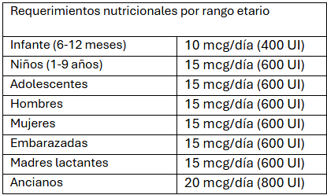

[^68]

[^68]: Office of Dietary Supplements - Vitamin D. (n.d.). https://ods.od.nih.gov/factsheets/VitaminD-HealthProfessional/
 

La vitamina D es un micronutriente liposoluble que difícilmente se encuentra en los alimentos, en los humanos la vitamina D se obtiene de manera endógena, es decir, que el mismo cuerpo la sintetiza a partir de la exposición solar[^1]. Debido a los hábitos que mantiene la mayoría de la población y características de la latitud donde se vive, la insuficiencia de vitamina D es muy común. Alimentos grasos como atún, sardinas, salmón, hígado y yema de huevos tienen a proporcionar una buena fuente de este micronutriente a la dieta, por otro lado, podemos encontrar muchos alimentos como sopas, jugos y cereales fortificados con esta vitamina para manejar en problema de insuficiencia en la población[^2].  

[^1]: Carlberg C. Molecular approaches for optimizing vitamin D supplementation. Vitam. Horm. 2016;100:255–271. doi: 10.1016/bs.vh.2015.10.001.
[^2]: Bendik I., Friedel A., Roos F.F., Weber P., Eggersdorfer M. Vitamin D: A critical and essential micronutrient for human health. Front. Physiol. 2014;5:248. doi: 10.3389/fphys.2014.00248.

La vitamina D como micronutriente, ya sea obtenido de manera natural a través de la exposición solar o por medio de una suplementación con capsulas o gotas, pasa por dos trasformaciones importantes. En el hígado es convertida a 25(OH)D3 (calcidiol)[^9], que es la forma más abundante de encontrarlo y por lo mismo se utiliza como biomarcador para evaluar los niveles de vitamina D en sangre[^4]. El 25(OH)D3 pasa a convertirse en 1,25(OH)2D3 (calcitriol) tras una transformación a que ocurre mayoritariamente a nivel de los riñones, esta es la forma hormonal de vitamina D que cumple funciones fundamentales en el cuerpo por medio de modulaciones genómicas, se encuentra regulada por la parathormona y lo niveles de calcio y fosfato[^3][^10]. 

[^3]: Carlberg, C. (2019). Nutrigenomics of vitamin D. Nutrients, 11(3), 676. https://doi.org/10.3390/nu11030676
[^4]: Hollis B.W. Circulating 25-hydroxyvitamin D levels indicative of vitamin D sufficiency: Implications for establishing a new effective dietary intake recommendation for vitamin D. J. Nutr. 2005;135:317–322. doi: 10.1093/jn/135.2.317.
[^9]: Czaja, A. J., & Montano-Loza, A. J. (2019). Evolving role of vitamin D in immune-mediated disease and its implications in autoimmune hepatitis. Digestive diseases and sciences, 64, 324-344.

Se considera que la vitamina D presenta alguna influencia en gran parte de los tejidos, esto se debe a que se pueden encontrar receptores de sus metabolitos en múltiples tejidos[^3][^5][^6][^7][^8]. El grado de relevancia que tenga la concentración sérica de esta vitamina solo ha sido estudiada bajo el rango normal de 25(OH)D3 en el cuerpo humano, ya que concentraciones mayores no han probado ser más beneficiosas y por el contrario se han asociado un número considerable de efectos adversos.  

Estudios epigenéticos han caracterizado la insuficiencia de vitamina D, se considera que la dosis de vitamina D suplementada a una persona debe ser dosificada según la respuesta de esta, ya que algunos pacientes pueden presentar una baja respuesta a dosis estándar y necesiten de una mayor concentración diaria[^1]. 

A nivel del intestino, el colecalciferol estimula la reabsorción de calcio y a nivel de los huesos estimula la diferenciación de los osteoblastos y calcificación de la matriz ósea. Además de su accion a nivel de los huesos se han descrito acciones inmunoreguladoras[^5][^6][^7][^8], de protección muscular y reguladoras del ánimo. 

[^5]: Bouillon, R.; Carmeliet, G.; Verlinden, L.; van Etten, E.; Verstuyf, A.; Luderer, H.F.; Lieben, L.; Mathieu, C.; Demay, M. Vitamin D and human health: Lessons from vitamin D receptor null mice. Endocr. Rev. 2008, 29, 726–776.
[^6]: Holick, M.F. Vitamin D deficiency. N. Engl. J. Med. 2007, 357, 266–281.
[^7]: Colotta, F.; Jansson, B.; Bonelli, F. Modulation of inflammatory and immune responses by vitamin D. J. Autoimmun. 2017, 85, 78–97.
[^8]: Prietl, B.; Treiber, G.; Pieber, T.R.; Amrein, K. Vitamin D and immune function. Nutrients 2013, 5, 2502–2521.

La concentración de vitamina D activa en el cuerpo esta estrictamente regulada por un sistema de feedback negativo. La vitamina D circulando inhibe la accion de la parathormona con lo que también se inhibe la activación a nivel renal de vitamina D y activa la accion de enzimas metabolizadoras de colecalciferol inactivo, disminuyendo la reabsorción ósea de calcio y aumenta su excreción renal, manteniendo las concentraciones activas en niveles normales y previniendo un exceso de señalización y actividad de la vitamina[^11][^12][^13][^14]. 

[^10]: Rosen, Y., Daich, J., Soliman, I., Brathwaite, E., & Shoenfeld, Y. (2016). Vitamin D and autoimmunity. Scandinavian journal of rheumatology, 45(6), 439-447.
[^11]: Dankers, W., Colin, E. M., Van Hamburg, J. P., & Lubberts, E. (2017). Vitamin D in autoimmunity: molecular mechanisms and therapeutic potential. Frontiers in immunology, 7, 697.
[^12]: Charoenngam, N., Rujirachun, P., Holick, M. F., & Ungprasert, P. (2019). Oral vitamin D 3 supplementation increases serum fibroblast growth factor 23 concentration in vitamin D-deficient patients: a systematic review and meta-analysis. Osteoporosis International, 30, 2183-2193.
[^13]: Bergwitz, C., & Jüppner, H. (2010). Regulation of phosphate homeostasis by PTH, vitamin D, and FGF23. Annual review of medicine, 61(1), 91-104.
[^14]: Charoenngam, N., Shirvani, A., & Holick, M. F. (2019). Vitamin D for skeletal and non-skeletal health: What we should know. Journal of clinical orthopaedics and trauma, 10(6), 1082-1093.
 

## Advertencias 

La intoxicación por vitamina D se caracteriza a nivel de laboratorio por una marcada hipercalcemia y niveles de 25(OH)D3 >375 nmol/L. Se pueden presentar síntomas como alteraciones cognitivas, confusión, apatía, mareo, depresión, psicosis y en casos extremos llegar al coma. Los síntomas gastrointestinales varían desde dolor abdominal, vómitos, polidipsia, anorexia, constipación, ulceras pépticas hasta pancreatitis[^15]. Las alteraciones cardiovasculares que se pueden presentar son hipertensión, disminución del intervalo QT, elevación del segmento ST y bradicardia. Los síntomas renales incluyen hipercalcemia, poliuria, polidipsia, deshidratación, nefro calcemia y falla renal[^16]. 

[^15]: Marcinowska-Suchowierska E., Kupisz-Urbanska M., Lukaszkiewicz J., Pludowski P., Jones G. Vitamin D Toxicity-A Clinical Perspective. Front Endocrinol. 2018;9:550. doi: 10.3389/fendo.2018.00550.
[^16]: Rolf L., Muris A.H., Bol Y., Damoiseaux J., Smolders J., Hupperts R. Vitamin D3 supplementation in multiple sclerosis: Symptoms and biomarkers of depression. J. Neurol. Sci. 2017;378:30–35. doi: 10.1016/j.jns.2017.04.017.

En caso de suplementarse con vitamina D es siempre preferible utilizar dosis bajas de > 800 UI/día. En caso de una deficiencia grave el medico indicara un tratamiento de dosis altas para alcanzar el rango plasmático normal. Tomar dosis mayores por un tiempo indefinido no tiene ningún beneficio para la salud y expone al paciente efectos adversos indeseables. 

## Accion del a vitamina D3 sobre la salud ósea 

Como se describió anteriormente, la vitamina D3 cumple un papel fundamental en la absorción de calcio y proliferación de la matriz ósea. En los últimos años se ha investigado numerosas veces el beneficio de la suplementación con vitamina D3 sobre la salud ósea, en particular para aquellos adultos mayores con mayor riesgo de fractura y caídas[^17][^23], sin embargo, los resultados han sido contradictorios en la gran mayoría de los casos sugiriendo que la suplementación debe ser basada en las necesidades propias de las personas bajo su nivel de insuficiencia.  

Recientes metaanálisis han identificado una reducción del 25% del riesgo de fractura de cadera en adultos mayores y una reducción general del 20% en fracturas de otros huesos. Esto se comprobó con una dosis diaria efectiva de 800 UI de vitamina D3 y 1200 mg de calcio[^17]. 

[^17]: Manoj, P., Derwin, R., & George, S. (2022). What is the impact of daily oral supplementation of vitamin D3 (cholecalciferol) plus calcium on the incidence of hip fracture in older people? A systematic review and meta‐analysis. International Journal of Older People Nursing, 18(1). https://doi.org/10.1111/opn.12492 
[^23]: Sunyecz, J. A. (2008). The use of calcium and vitamin D in the management of osteoporosis. Therapeutics and Clinical Risk Management, 4(4), 827–836. 10.2147/tcrm.s3552

La suplementación de vitamina D3 por sí sola no ha mostrado resultados estadísticamente relevantes sobre la salud ósea, por lo que si el objetivo es prevenir fracturas en adultos mayores siempre debe ser acompañado por una suplementación adicional de calcio[^24]. En aquellos adultos con niveles adecuados de vitamina D en plasma no se recomienda incorporar la suplementación a su dieta[^22], ya que demás de no presentar beneficio alguno se aumenta el riesgo de supresión de la parathormona por el mecanismo de feedback negativo de la vitamina D[^18][^19]. Esto puede llevar a problemas en la reabsorción del calcio a nivel de los huesos[^20][^21], potencialmente teniendo un efecto opuesto al esperado disminuyendo la densidad ósea. 

[^18]: Institute of Medicine . Dietary Reference Intakes for Calcium and Vitamin D. Washington, DC: The National Academies Press; 2011.
[^19]: Burt, L. A., Billington, E. O., Rose, M. S., Raymond, D. A., Hanley, D. A., & Boyd, S. K. (2019). Effect of High-Dose Vitamin D supplementation on volumetric bone density and bone strength. JAMA, 322(8), 736. https://doi.org/10.1001/jama.2019.11889 
[^20]: Sanders KM, Stuart AL, Williamson EJ, et al. Annual high-dose oral vitamin D and falls and fractures in older women. JAMA. 2010;303(18):1815-1822. doi: 10.1001/jama.2010.594
[^21]: Sanders KM, Nicholson GC, Ebeling PR. Is high dose vitamin D harmful? Calcif Tissue Int. 2013;92(2):191-206. doi: 10.1007/s00223-012-9679-1
[^22]: Reid, I. R. , & Bolland, M. J. (2019). Controversies in medicine: The role of calcium and vitamin D supplements in adults. Medical Journal of Australia, 211(10), 468–473.
[^24]: LeBoff, M. S., Chou, S. H., Ratliff, K. A., Cook, N. R., Khurana, B., Kim, E., Cawthon, P. M., Bauer, D. C., Black, D., Gallagher, J. C., Lee, I., Buring, J. E., & Manson, J. E. (2022). Supplemental vitamin D and incident fractures in midlife and older adults. New England Journal of Medicine, 387(4), 299–309. https://doi.org/10.1056/nejmoa2202106 

 

## Accion de la vitamina D en la regulación sobre el sistema inmune 

El interés sobre la actividad de la vitamina D en el sistema inmune inicia por su potencial antimicrobiano, desde los años 60 se conoce el rol que cumple el colecalciferol frente a la Mycobacterium tuberculosis, causante de la tuberculosis[^25]. La vitamina D se encarga de activar la actividad antimicrobiana de macrófagos y monocitos, lo que a su vez estimula la producción de catelicidinas, péptidos antimicrobianos que se adhieren a la membrana microbiana eliminando al agente patógeno[^26][^27][^28][^29]. Estas catelicidinas pueden actuar sobre distintos tipos de bacterias, hongos e incluso virus respiratorios[^30][^31][^32][^33]. 

[^25]: Gombart A.F., Borregaard N., Koeffler H.P. Human cathelicidin antimicrobial peptide (CAMP) gene is a direct target of the vitamin D receptor and is strongly up-regulated in myeloid cells by 1,25-dihydroxyvitamin D3. FASEB J. 2005;19:1067–1077. doi: 10.1096/fj.04-3284com.
[^26]: Shahmiri, M., Enciso, M., Adda, C. G., Smith, B. J., Perugini, M. A., & Mechler, A. (2016). Membrane core-specific antimicrobial action of cathelicidin LL-37 peptide switches between pore and nanofibre formation. Scientific reports, 6(1), 38184.
[^27]: Barlow, P. G., Svoboda, P., Mackellar, A., Nash, A. A., York, I. A., Pohl, J., ... & Donis, R. O. (2011). Antiviral activity and increased host defense against influenza infection elicited by the human cathelicidin LL-37. PloS one, 6(10), e25333.
[^28]: Liu, P. T., Stenger, S., Tang, D. H., & Modlin, R. L. (2007). Cutting edge: vitamin D-mediated human antimicrobial activity against Mycobacterium tuberculosis is dependent on the induction of cathelicidin. The journal of immunology, 179(4), 2060-2063.
[^29]: Adams, J. S., & Hewison, M. (2008). Unexpected actions of vitamin D: new perspectives on the regulation of innate and adaptive immunity. Nature clinical practice Endocrinology & metabolism, 4(2), 80-90.
[^30]: Aranow, C. (2011). Vitamin D and the immune system. Journal of investigative medicine, 59(6), 881-886.
[^31]: Siddiqui, M., Manansala, J. S., Abdulrahman, H. A., Nasrallah, G. K., Smatti, M. K., Younes, N., ... & Yassine, H. M. (2020). Immune modulatory effects of vitamin D on viral infections. Nutrients, 12(9), 2879.
[^32]: Tripathi, S., Tecle, T., Verma, A., Crouch, E., White, M., & Hartshorn, K. L. (2013). The human cathelicidin LL-37 inhibits influenza A viruses through a mechanism distinct from that of surfactant protein D or defensins. Journal of General Virology, 94(1), 40-49.
[^33]: Sousa, F. H., Casanova, V., Findlay, F., Stevens, C., Svoboda, P., Pohl, J., ... & Barlow, P. G. (2017). Cathelicidins display conserved direct antiviral activity towards rhinovirus. Peptides, 95, 76-83.

Se ha evidenciado que la vitamina D y sus metabolitos tienen una importante influencia sobre la función de varias células inmunes. Dentro de sus funciones en el sistema inmune, la vitamina D influye en la actividad de las células detríticas y la producción de la citoquina proinflamatoria IL-12[^34][^35]; también regula la actividad de las células NK del sistema inmune; el proceso de desgranulación que libera productos de ataque desde el interior de células especializadas; interviene en la diferenciación y proliferación de células B, disminuyendo la producción de anticuerpos y anti anticuerpos; la liberación de citoquinas proinflamatorias y la expresión de TLR4 que activa la respuesta inmune[^36]. Todas estas funciones sugieren que la vitamina D puede cumplir un papel complementario ante enfermedades autoinmunes como cáncer, psoriasis, esclerosis múltiple, artritis reumatoide, entre otras.  

[^34]: Ao, T., Kikuta, J., & Ishii, M. (2021). The effects of vitamin D on immune system and inflammatory diseases. Biomolecules, 11(11), 1624.
[^35]: Rosen, Y., Daich, J., Soliman, I., Brathwaite, E., & Shoenfeld, Y. (2016). Vitamin D and autoimmunity. Scandinavian journal of rheumatology, 45(6), 439-447.
[^36]: Sîrbe, C., Rednic, S., Grama, A., & Pop, T. L. (2022). An update on the effects of vitamin D on the immune system and autoimmune diseases. International Journal of Molecular Sciences, 23(17), 9784. https://doi.org/10.3390/ijms23179784

A nivel del intestino, la vitamina D ayuda a mantener la integridad del tejido y conservar una relación balanceada entre el intestino y el microbiota que la habita[^37]. Las señales involucradas con la vitamina D mantienen la integridad fisica de las células epiteliales y limita el daño bacteriano sobre estas, por otro lado, se ha relacionado la presencia de vitamina D con una mayor expresión de proteínas de reconocimiento de agentes patógenos[^39][^40] y una promoción de proteínas antimicrobianas a nivel del intestino[^38]. Su aporte a la protección del microbiota e integridad del epitelio, además de su contribución desde la vía del sistema inmunológico descrito anteriormente, mantienen un balance homeostático que podria prevenir enfermedades autoinflamatorias y metabólicas originadas desde el intestino[^36]. 

[^37]: Lee, C., Lau, E., Chusilp, S., Filler, R., Li, B., Zhu, H., ... & Pierro, A. (2019). Protective effects of vitamin D against injury in intestinal epithelium. Pediatric Surgery International, 35, 1395-1401.
[^38]: Fakhoury, H. M., Kvietys, P. R., AlKattan, W., Al Anouti, F., Elahi, M. A., Karras, S. N., & Grant, W. B. (2020). Vitamin D and intestinal homeostasis: Barrier, microbiota, and immune modulation. The journal of steroid biochemistry and molecular biology, 200, 105663.
[^39]: Zhang, Y. G., Wu, S., & Sun, J. (2013). Vitamin D, vitamin D receptor and tissue barriers. Tissue barriers, 1(1), e23118.
[^40]: Wang, T. T., Dabbas, B., Laperriere, D., Bitton, A. J., Soualhine, H., Tavera-Mendoza, L. E., ... & White, J. H. (2010). Direct and indirect induction by 1, 25-dihydroxyvitamin D3 of the NOD2/CARD15-defensin β2 innate immune pathway defective in Crohn disease. Journal of Biological Chemistry, 285(4), 2227-2231.

 

## Coadyuvante en el rendimiento físico 

Se ha relacionado niveles subóptimos de vitamina D con una mayor debilidad muscular y disminución del tono muscular. La deficiencia de esta vitamina puede contribuir a la atrofia de las fibras musculares tipo 2 que se presenta principalmente en adultos mayores[^41].  

[^41]: Książek, A., Zagrodna, A., & Słowińska-Lisowska, M. (2019). Vitamin D, Skeletal Muscle Function and Athletic Performance in Athletes—A Narrative Review. Nutrients, 11(8), 1800. https://doi.org/10.3390/nu11081800 

La vitamina D activa varios procesos metabólicos en las células musculares que resulta en una mayor proliferación de células musculares tipo 2[^41], tanto en cantidad como en diámetro, lo que contribuye a una mejor contracción muscular, velocidad y fuerza[^42][^43]. Además de contribuir a la síntesis proteica también ayuda en la inhibición de la apoptosis de estas células[^44][^45]. Por otro lado, la vitamina D también regula la actividad mitocondrial y enzimáticas en las células musculares[^46][^47]. 

[^42]: Deschenes, M. R., Brewer, R. E., Bush, J. A., McCoy, R. W., Volek, J. S., & Kraemer, W. J. (2000). Neuromuscular disturbance outlasts other symptoms of exercise-induced muscle damage. Journal of the neurological sciences, 174(2), 92-99.
[^43]: Dzik, K. P., & Kaczor, J. J. (2019). Mechanisms of vitamin D on skeletal muscle function: oxidative stress, energy metabolism and anabolic state. European journal of applied physiology, 119, 825-839.
[^44]: Todd J.J., Pourshahidi L.K., McSorley E.M., Madigan S.M., Magee P.J. Vitamin D: Recent advances and implications for athletes. Sports Med. 2015;45:213–229. doi: 10.1007/s40279-014-0266-7. 
[^45]: Owens D.J., Fraser W.D., Close G.L. Vitamin D and the athlete: Emerging insights. Eur. J. Sport Sci. 2015;15:73–84. doi: 10.1080/17461391.2014.944223.
[^46]: Iolascon G., Moretti A., de Sire A., Calafiore D., Gimigliano F. Effectiveness of calcifediol in improving muscle function in post-menopausal women: A prospective cohort study. Adv. Ther. 2017;34:744–752. doi: 10.1007/s12325-017-0492-0. 
[^47]: Hamilton B. Vitamin D and human skeletal muscle. Scand. J. Med. Sci. Sports. 2010;20:182–190. doi: 10.1111/j.1600-0838.2009.01016.x.

La hipertrofia de las células musculares tipo 2B puede afectar el rendimiento atlético de las personas, este tipo de células musculares son relevantes para el rendimiento ya que generan una mayor contracción muscular y fuerza que las fibras musculares tipo 1[^43][^42]. Gracias a la participación de la vitamina D en la recuperación de las fibras musculares 2B teóricamente se puede esperar que el paciente tenga una recuperación de su capacidad fisica en menor tiempo. 

 

## Relación de la vitamina D con la permeabilidad vascular 

La vitamina D y sus metabolitos interviene en la permeabilidad vascular y función endotelial por varios mecanismos. Se ha descubierto que sus metabolitos pueden estabilizar el endotelio vascular y actuar sobre la eNOS provocando una mayor producción de NO en el endotelio[^48][^49]. Este último efecto proporciona una mejor dilatación del tejido a favor del flujo periférico de la sangre. 

[^48]: Gibson, C.C.; Davis, C.T.; Zhu, W.; Bowman-Kirigin, J.A.; Walker, A.E.; Tai, Z.; Thomas, K.R.; Donato, A.J.; Lesniewski, L.A.; Li, D.Y. Dietary Vitamin D and Its Metabolites Non-Genomically Stabilize the Endothelium. PLoS ONE 2015, 10, e0140370.
[^49]: Molinari, C.; Uberti, F.; Grossini, E.; Vacca, G.; Carda, S.; Invernizzi, M.; Cisari, C. 1α,25-Dihydroxycholecalciferol Induces Nitric Oxide Production in Cultured Endothelial Cells. Cell. Physiol. Biochem. 2011, 27, 661–668. 

En modelos animales se observó que los metabolitos de vitamina D estimulaban las uniones celulares basadas en la cadherina endotelial vascular (VE-cadherin) permitiendo una mejor conectividad y comunicación entre las celulas del tejido endotelial vascular; inhiben la formación de fibras de estrés asociadas a la aparición de metástasis; y limitan el daño endotelial en la enfermedad renal crónica[^50]. Estos descubrimientos sugieren que la vitamina D tiene un papel preventivo en la disfunción vascular y sobre la inflamación sistémica asociada al daño de los tejidos. 

[^50]: Vila Cuenca, M., Ferrantelli, E., Meinster, E., Pouw, S. M., Kovačević, I., de Menezes, R. X., ... & Vervloet, M. G. (2018). Vitamin D attenuates endothelial dysfunction in uremic rats and maintains human endothelial stability. Journal of the American Heart Association, 7(17), e008776.

Estudios en animales han evidenciado también que la vitamina D puede regular el sistema regina-angiotensina-aldosterona por supresión de la expresión genética de renina[^51]. Este sistema actúa directamente sobre la presión arterial, siendo uno de los focos principales de tratamiento farmacológico modernos. 

[^51]: Li YC, Qiao G, Uskokovic M, Xiang W, Zheng W, Kong J. Vitamin D: a negative endocrine regulator of the renin-angiotensin system and blood pressure. J Steroid Biochem Mol Biol. 2004;89-90(1-5):387-392. doi: 10.1016/j.jsbmb.2004.03.004 

A pesar de la evidencia positiva, los estudios en humanos realizados hasta la fecha han dado resultados contradictorios entre sí. El estudio más reciente en pacientes adultos mayores fue publicado en 2020, donde más de 2000 participantes de 70 años o más fueron suplementados con vitamina D con un seguimiento de 3 años, el estudio concluyo que si bien se obtuvieron resultados mixtos no se podría considerar un efecto estadísticamente significativo sobre la salud cognitiva, capacidad fisica ni la presión sanguínea[^52]. Se debe considerar que en este estudio solo el 40.7% de los participantes presentaba una concentración sérica de vitamina D por debajo del rango normal, por lo que los beneficios esperados no hayan sido destacables como si se esperaría de una población con insuficiencia de vitamina D. 

[^52]: Bischoff-Ferrari, H. A., Vellas, B., Rizzoli, R., Kressig, R. W., Da Silva, J. a. P., Blauth, M., Felson, D. T., McCloskey, E. V., Watzl, B., Hofbauer, L. C., Felsenberg, D., Willett, W. C., Dawson-Hughes, B., Manson, J. E., Siebert, U., Theiler, R., Staehelin, H. B., De Godoi Rezende Costa Molino, C., Chocano-Bedoya, P. O., . . . Orav, E. J. (2020). Effect of vitamin D supplementation, omega-3 fatty acid supplementation, or a Strength-Training exercise program on clinical outcomes in older adults. JAMA, 324(18), 1855. https://doi.org/10.1001/jama.2020.16909 

 

 

## Accion de la vitamina D en pacientes con enfermedad pulmonar obstructiva crónica (EPOC) 

En pacientes EPOC se ha detectado una menor concentración de vitamina D plasmática, por lo que se ha considerado que esta podría afectar directamente la progresión y severidad de la condición[^53][^54]. 

[^53]: Maltais F, Decramer M, Casaburi R, Barreiro E, Burelle Y, Debigaré Ret al. . An official American Thoracic Society/European Respiratory Society statement: update on limb muscle dysfunction in chronic obstructive pulmonary disease. Am J Respir Crit Care Med. 2014;189(9):e15–62.
[^54]: Swallow EB, Reyes D, Hopkinson NS, Man WD, Porcher R, Cetti EJet al. . Quadriceps strength predicts mortality in patients with moderate to severe chronic obstructive pulmonary disease. Thorax. 2007;62(2):115–20.

La enfermedad pulmonar obstructiva crónica se caracteriza por una limitación progresiva de la capacidad pulmonar producto de una inflamación anormal del tejido producto de agentes irritantes como el humo de tabaco[^55]. Gracias a la relación de la vitamina D sobre el sistema inmune se teoriza que su presencia disminuiría a los factores de proinflamacion responsables de las exacerbaciones[^56]. Se sugiere también que gracias al factor antimicrobiano que tiene sobre el cuerpo se evitarían episodios de excaservacion asociados a enfermedades infecciosas pulmonares[^56], que son responsables de gran parte de las hospitalizaciones de estos pacientes.  

[^55]: Rafiq, R., Aleva, F. E., Schrumpf, J. A., Daniels, J. M., Bet, P. M., Boersma, W. G., Bresser, P., Spanbroek, M., Lips, P., Van Den Broek, T. J., Keijser, B. J., Van Der Ven, A. J., Hiemstra, P. S., Heijer, M. D., & De Jongh, R. T. (2022). Vitamin D supplementation in chronic obstructive pulmonary disease patients with low serum vitamin D: a randomized controlled trial. American Journal of Clinical Nutrition, 116(2), 491–499. https://doi.org/10.1093/ajcn/nqac083 
[^56]: Bouillon R, Marcocci C, Carmeliet G, Bikle D, White JH, Dawson-Hughes Bet al. . Skeletal and extraskeletal actions of vitamin D: current evidence and outstanding questions. Endocr Rev. 2019;40(4):1109–51.

Sin embargo, no existe evidencia que confirme una disminución en el número de excavaciones por una suplementación de vitamina D. Se propone que pudiese evidenciarse resultados significativos en aquellos pacientes con una marcada deficiencia de esta vitamina y no al paciente EPOC con niveles séricos normales[^55]. 

 

## Efecto de la vitamina D en la progresión de diabetes mellitus 2 

Se ha asociado una deficiencia de vitamina D en pacientes diabéticos[^57]. Se considera que la presencia de vitamina D puede presentar un factor protector ante la progresión de la enfermedad, particularmente por la presencia de receptores de los metabolitos de vitamina D en órganos relacionados con la enfermedad como el hígado, músculos, tejido adiposo y celulas beta[^58][^59]. 

[^57]: Holick MF. Vitamin D deficiency. N Engl J Med. 2007;357(3): 266–81.
[^58]: Mathieu C. Vitamin D and diabetes: Where do we stand? Diabetes Res Clin Pract 2015;108(2):201–9
[^59]: Berridge MJ. Vitamin D deficiency and diabetes. Biochem J. 2017;474(8):1321–32.

La vitamina D influye en la sensibilidad a la insulina[^60]. Está involucrada en la secreción de la insulina, en las celulas pancreáticas se encuentran receptores asociados la presencia de vitamina D, estos secretan insulina dependiendo de cambios en la concentración intracelular de calcio y el flujo de calcio se encuentra regulado por metabolitos de vitamina D[^60]. Un mecanismo similar se encuentra en las celulas adiposas, donde el flujo de calcio puede afectar en la lipogénesis y lipolisis de las reservas adiposas[^61]. 

[^60]: Derosa, G., D’Angelo, A., Martinotti, C., Valentino, M. C., Di Matteo, S., Bruno, G. M., & Maffioli, P. (2020). Vitamin D3 supplementation improves glycemic control in type 2 diabetic patients: Results from an Italian clinical trial. International Journal for Vitamin and Nutrition Research, 92(2), 91–100. https://doi.org/10.1024/0300-9831/a000673 
[^61]: Shi H, Norman AW, Okamura WH, Sen A, Zemel MB.1alpha,25-dihydroxyVitamin D3 inhibits uncoupling protein 2 expression in human adipocytes. Faseb J. 2002;16:1808–10.

En pacientes diabéticos se vio una reducción significativa en la prueba de glucosa en ayunas (reducción de 7,1% respecto al grupo control tras 6 meses) y en HbA1c (reducción de 2,6% respecto al grupo control tras 6 meses). También se notó una disminución en la cantidad de mg de fármacos hipoglucémicos que los participantes ocupaban durante la intervención[^60].  

## Accion de la vitamina D en cuadros depresivos 

La incidencia en el aumento de episodios depresivos asociados a cambios estacionales es alta, por lo que ha surgido el interés en el uso de suplementación de vitamina D como objeto terapéutico.  

Hasta la fecha muchos estudios han evaluado su potencial terapéutico, mostrando resultados contradictorios entre sí. Un estudio estadounidense publicado en 2020 para la revista médica JAMA estudio el efecto en un periodo de 5.3 años en 18.353 pacientes mayores de 50 años sin enfermedades psicológicas de base, concluyó que la suplementación con vitamina D no tenía una incidencia estadísticamente significante sobre síntomas depresivos o mejorías del ánimo[^62]. Por otro lado, en 2024 se publicó un estudio realizado en la india a jóvenes adolescentes de procedencia rural, este seguimiento fue realizado por un periodo de tres años donde se concluyó un efecto positivo con la suplementación con un bajo reporte de síntomas depresivos[^63].

[^62]: Okereke, O. I., Reynolds, C. F., Mischoulon, D., Chang, G., Vyas, C. M., Cook, N. R., Weinberg, A., Bubes, V., Copeland, T., Friedenberg, G., Lee, I., Buring, J. E., & Manson, J. E. (2020). Effect of Long-term Vitamin D3 Supplementation vs Placebo on Risk of Depression or Clinically Relevant Depressive Symptoms and on Change in Mood Scores. JAMA, 324(5), 471. https://doi.org/10.1001/jama.2020.10224 
[^63]: Satyanarayana, P. T., Suryanarayana, R., Yesupatham, S. T., Ramalingareddy, S. R. V., & Gopalli, N. A. (2024). Does Vitamin D3 Supplementation Improve Depression Scores among Rural Adolescents? A Randomized Controlled Trial. Nutrients, 16(12), 1828. https://doi.org/10.3390/nu16121828 

Se considera que la vitamina D influye en la incidencia de cuadros depresivos por el rol crucial que juega en la regulación de neurotransmisores y la neuro inmunomodulación[^64][^65]. Regiones específicas del cerebro relacionadas con la respuesta depresiva presentan receptores de vitamina D[^66]. Por otro lado, la vitamina D regula el eje hipotalámico-pituitario-adrenal encargado de la regulación de la producción de neurotransmisores epinefrina, norepinefrina y dopamina en la corteza adrenal, y también protege la depleción de dopamina y serotonina. Se ha establecido un potencial antioxidante y antiinflamatorio que puede disminuir la concentración de citoquinas inflamatorias a nivel intracraneal relacionadas con la depresión[^67].  

[^64]: Milaneschi Y., Hoogendijk W., Lips P.T., Heijboer A.C., Schoevers R., Van Hemert A.M., Beekman A.T., Smit J.H., Penninx B.W. The association between low vitamin D and depressive disorders. Mol. Psychiatry. 2014;19:444–451. doi: 10.1038/mp.2013.36.
[^65]: Esnafoglu E., Ozturan D.D. The relationship of severity of depression with homocysteine, folate, vitamin B12, and vitamin D levels in children and adolescents. Child Adolesc. Mental Health. 2020;25:249–255. doi: 10.1111/camh.12387. 
[^66]: Akpınar Ş., Karadağ M.G. Is Vitamin D Important in Anxiety or Depression? What Is the Truth? Curr. Nutr. Rep. 2022;11:675–681. doi: 10.1007/s13668-022-00441-0.
[^67]: Zhu D.M., Zhao W., Zhang B., Zhang Y., Yang Y., Zhang C., Wang Y., Zhu J., Yu Y. The relationship between serum concentration of vitamin D, total intracranial volume, and severity of depressive symptoms in patients with major depressive disorder. Front. Psychiatry. 2019;10:322. doi: 10.3389/fpsyt.2019.00322.